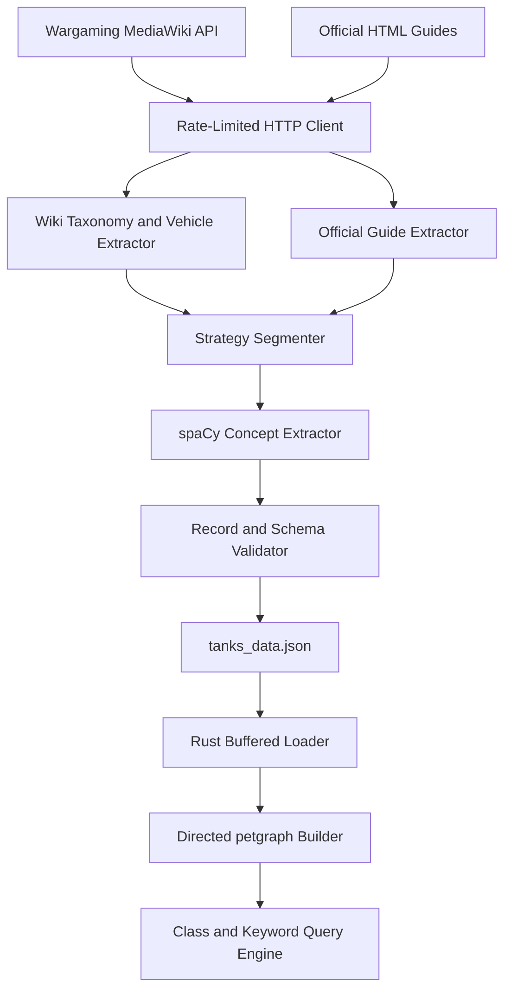
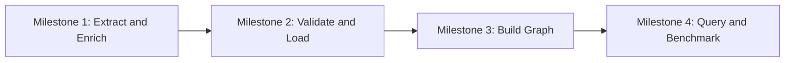

# Project Overview

## Status

This document is the canonical product and architecture specification for Tank
Graph. The milestone specifications refine it. If two documents conflict, this
overview controls shared architecture and the milestone document controls only
its local implementation details.

## Objective

Build a maintainable pipeline that:

1. Collects World of Tanks taxonomy, vehicle metadata, and tactical prose from
   the Wargaming wiki and official guides.
2. Converts the collected material into deterministic, validated tank records.
3. Loads those records into a strongly typed, in-memory Rust graph.
4. Answers class and tactical-keyword queries with query-only latency reported
   in microseconds.

The architecture deliberately assigns web and language-processing work to
Python and graph construction and querying to Rust. A versioned JSON document
is the only data boundary between those runtimes.

## Scope

### Included

- Recursive traversal from `Category:Tanks`, including nested categories.
- Vehicle-template and tactical-section extraction from wiki pages.
- Curated scraping of official guide pages beneath the approved guide root.
- English NLP with spaCy `en_core_web_sm`.
- A deterministic `tanks_data.json` array validated by JSON Schema.
- Buffered Rust deserialization and semantic validation.
- A directed `petgraph` adjacency-list graph with typed nodes and edges.
- Queries by class and keyword.
- Correctness tests, fixture-based network tests, and query benchmarks.

### Excluded

- Browser automation, authenticated endpoints, or bypassing access controls.
- Editing source sites.
- An external graph database, persistent graph format, or distributed runtime.
- Continuous crawling, scheduling, or incremental synchronization in the first
  four milestones.
- A web API or graphical user interface.
- Machine translation or non-English NLP.
- Treating benchmark targets as portable claims across arbitrary hardware.

## Authoritative endpoints

The implementation must keep endpoints configurable for tests, but production
defaults are:

| Source | Endpoint |
| --- | --- |
| MediaWiki Action API | `https://wiki.wargaming.net/api.php` |
| Official guide root | `https://worldoftanks.com/en/content/guide/` |
| Newcomer getting-started guide | `https://worldoftanks.com/en/content/guide/newcomers-guide/getting_started/` |

`https://wargaming.net` is a corporate site, not the MediaWiki API endpoint.

Before collection, the extractor must verify applicable source policies,
including `robots.txt`. A disallowed optional guide route must be skipped and
reported; the extractor must not attempt a workaround. If policy disallows the
required MediaWiki API, root category, or every configured guide source, the
run is unsuccessful and must not publish a replacement dataset.

## Architecture



## Component boundaries

### Python extractor

Owns network access, source-specific parsing, tactical text segmentation,
concept normalization, record validation, and JSON generation. All network
traffic from every source shares one limiter.

The extractor may use richer internal records containing source URL, source
kind, category path, and extraction diagnostics. Those fields are provenance
for processing and logs; they are not part of the Milestone 1 output contract.

### JSON interchange

The root document is a JSON array. Each item represents one unique tank and
must validate against
[`tanks-data.schema.json`](tanks-data.schema.json). The extractor must emit no
additional top-level envelope because the Rust loader expects the array
directly.

The schema is the syntactic contract. The milestone specifications add semantic
rules that JSON Schema cannot fully express, including normalized uniqueness,
deterministic ordering, and relationships between class and subclass values.

### Rust graph engine

Owns input safety checks, typed deserialization, semantic validation, graph
construction, graph indexes, traversal, stable result formatting, and
performance measurement. It must not scrape, infer missing source fields, or
silently repair invalid JSON.

## Target repository layout

The implementation milestones are expected to evolve toward this layout. This
tree defines responsibility, not a requirement to create empty placeholder
files.

```text
tank-graph/
├── README.md
├── docs/
│   └── specs/
├── python/
│   ├── pyproject.toml
│   ├── src/tank_graph_extractor/
│   └── tests/
├── rust/
│   ├── Cargo.toml
│   ├── src/
│   ├── tests/
│   └── benches/
└── data/
    └── tanks_data.json
```

Milestone 1 creates the Python package and output location. Milestone 2 creates
the Cargo binary package. Test fixtures remain under their owning component and
must not be confused with production output.

## Shared domain terms

| Term | Meaning |
| --- | --- |
| Tank | One playable vehicle uniquely identified by its stable internal name. |
| Display name | Human-readable vehicle name shown in query output. |
| Primary class | The tank's principal role, such as `Heavy Tanks`. |
| Subclass | A narrower category associated with the tank, such as `Autoloaders`. |
| Strategy | A concise tactical statement associated with a tank. |
| Keyword | A normalized tactical concept associated with a strategy. |
| Guide context | General official advice assigned through canonical class scope and optionally annotated with tactical concepts before tank records are assembled. |
| Query-only time | Traversal and result collection after the graph and indexes are fully built. |

## Shared invariants

1. A tank's `name` is the stable identity across the pipeline.
2. Human-readable text is valid UTF-8 and contains no markup or control
   characters other than ordinary JSON whitespace.
3. Primary classes, subclasses, strategies, and keywords are non-empty after
   trimming.
4. Collections contain no duplicates under their documented normalized
   identity.
5. Output order is deterministic: tank records by normalized `name`, and each
   record's arrays by normalized value.
6. Python produces data; Rust consumes it without source-specific knowledge.
7. Production code never relies on a live network in unit or CI tests.
8. No user-controlled parse error, path, or query may cause a panic or disclose
   unrelated file contents.
9. Network logs may include URLs, status codes, delays, and attempt counts but
   must not include secrets or full response bodies.
10. Every failure is either recoverable and explicitly retried or terminal and
    returned with source context. No record is silently dropped.

## Canonical identity and ordering

Python and Rust must compute the same normalized identity key for validation,
deduplication, lookup, and ordering:

1. Normalize Unicode with NFKC.
2. Trim outer whitespace and collapse each internal Unicode-whitespace run to
   one U+0020 space.
3. Convert Unicode hyphen variants to ASCII `-`.
4. Apply Unicode full case folding.
5. Preserve all other punctuation.

Values emitted by Python are already NFKC-normalized, trimmed, whitespace
collapsed, and hyphen-canonicalized. Display capitalization is preserved for
display names and strategies; identity keys are case folded.

Every deterministic string sort uses the tuple `(normalized identity key,
original Unicode scalar sequence)`. The second member is a tie-breaker only.
Tank records sort by this key for `name`; every repeated-value array sorts by
this key for its own values.

## Configuration and secrets

The extractor must require a descriptive User-Agent in this shape:

```text
WoTGraphBot/<version> (contact: <maintainer-contact>)
```

The contact must be supplied through documented configuration and must not be a
placeholder. Startup fails before network access if it is absent or malformed.
No credentials are required by the specified sources. If future sources require
credentials, they must be supplied outside tracked files and redacted from
diagnostics.

The Rust CLI accepts the data path explicitly. It must not perform implicit
network access or search arbitrary parent directories for data.

## Delivery sequence



A milestone is complete only when all of its exit criteria pass. A later
milestone must not weaken an earlier contract to make implementation easier.

## Global definition of done

- All specified deliverables exist and contain no placeholders or unresolved
  decisions.
- Automated tests for the completed milestone pass without live network access.
- User-controlled failures are actionable and do not panic.
- Examples and commands in user-facing help are valid for the documented
  layout.
- Generated data is schema-valid and deterministic.
- Documentation and behavior use the same endpoints, field names, enum names,
  edge directions, and normalization rules.
